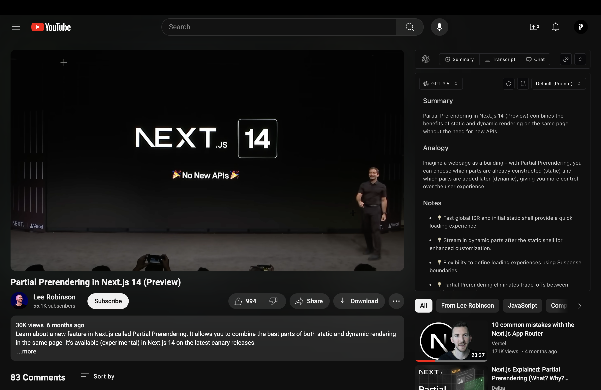

<h1 align="center">YouTube AI Extension</h1>

<p align="center" style="padding: 20px 0;">
YouTube Chat Extension allows you to chat directly with YouTube videos, providing a unique interactive experience.
</p>

<p align="center">
  <a href="https://www.youtube.com/watch?v=d35tmCKP4ds&ab_channel=PaoloNessim"><strong>Demo Video</strong></a> ·
  <a href="#features"><strong>Features</strong></a> ·
  <a href="#roadmap"><strong>Roadmap</strong></a> ·
  <a href="#installation"><strong>Installation</strong></a> ·
  <a href="#acknowledgments"><strong>Acknowledgments</strong></a>
</p>
<br/>

## Features

- Seamlessly chat with YouTube videos in real-time.
- Get video summaries, ask questions, and receive detailed explanations.
- User-friendly interface integrated directly into YouTube.
- Support for multiple languages and context-aware responses.

## Roadmap

- Support Ollama
- RAG for longer videos ?
- More features

## Installation

To install and run the YouTube Chat Extension locally, follow these steps:

1. Clone the repository:

   ```bash
   git clone https://github.com/PaoloJN/youtube-ai-extension.git

   cd youtube-chat-extension
   ```

2. Add your OpenAI API key. Replace `YOUR_API_KEY` with your actual key in the files `chat.ts` and `completion.ts`

   ```typescript
   const openai = new OpenAI({
     apiKey: "YOUR_API_KEY"
   })
   ```

3. Install the dependencies and build the project:

   ```bash
   pnpm install
   pnpm run build
   ```

4. Load the extension into Chrome:

   1. Open Chrome and navigate to `chrome://extensions/`.
   2. Enable "Developer mode" by toggling the switch in the top right corner.
   3. Click "Load unpacked" and select the `build/chrome-mv3-dev` directory from the project you just built.

5. Open YouTube and start chatting with videos! :)

> The extension does not support the new YouTube layout. To revert to the old layout, use the uBlock Origin extension. The extension should then work correctly.


## Acknowledgments

This project wouldn't be possible without the following resources:

- [OpenAI API](https://openai.com/api/)
- [React](https://reactjs.org)
- [Tailwind CSS](https://tailwindcss.com)
- [Plasmo Extension](https://www.plasmo.com)
- [Chrome Extension Documentation](https://developer.chrome.com/docs/extensions/)
